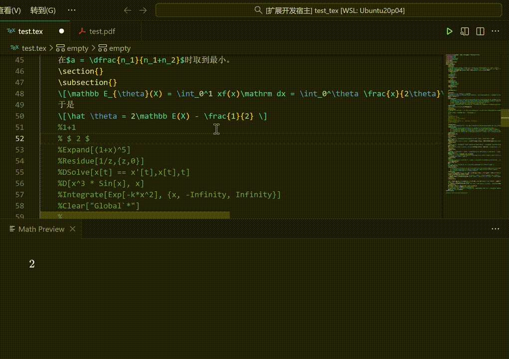

# WolfTeX

**WolfTeX** is a simple but effective, out-of-the-box VS Code extension that seamlessly integrates Wolfram Mathematica execution into your LaTeX workflow. It allows you to evaluate Wolfram Language code directly within your LaTeX documents, inserting the results as either plain text or LaTeX-formatted equations. The intended application scenario is for users to input Wolfram code in comments as drafts or for demonstration, without adding any dependencies to the original LaTeX file.



## Features

*   **Execute Wolfram Code**: Run Wolfram Language code directly from your editor.
*   **LaTeX Output**: Automatically convert results to LaTeX format (e.g., `D[x^3 * Sin[x], x]` $\to$ `$ x^3 \cos (x)+3 x^2 \sin (x) $`).
*   **Persistent Kernel**: Uses a persistent background kernel for high-performance execution (sub-second latency) and variable persistence (variables defined in one cell are available in the next).
*   **Context Isolation**: User variables are kept in the `Global` context, while kernel logic runs in a private context, ensuring `Clear["Global`*"]` works safely.
*   **Smart Formatting**: Supports both `InputForm` (for code/text) and `TeXForm` (for math).

## Requirements

*   **Wolfram Engine** or **Mathematica** with **Wolfram Script** (requires version **13.0** or higher).
*   `wolframscript` must be available in your system PATH.

## Usage

1.  Open a LaTeX file (`.tex`).
2.  Write your Wolfram code.
3.  Place your cursor on the line containing the code.
4.  Run one of the following commands via the Command Palette (`Ctrl+Shift+P` or `Cmd+Shift+P`):

    *   **WolfTeX: Evaluate Line with WolframScript**: Evaluates the current line and inserts the result as plain text (InputForm).
    *   **WolfTeX: Evaluate Line to LaTeX**: Evaluates the current line and inserts the result as LaTeX code (TeXForm).

### Example

**Input:**
```latex
% Calculate the integral
Integrate[Sin[x]^2, x]
```

**Action:** Run `WolfTeX: Evaluate Line to LaTeX`

**Output:**
```latex
% Calculate the integral
Integrate[Sin[x]^2, x]
\frac{x}{2} - \frac{1}{4} \sin(2 x)
```

## Extension Settings

Currently, WolfTeX works out-of-the-box and does not require additional configuration. It automatically detects an available port for the kernel server.

## Known Issues

*   Ensure `wolframscript` is activated. If you see license errors, run `wolframscript` in your terminal to activate it first.

---

# WolfTeX (中文文档)

**WolfTeX** 是一个简单但有效、开箱即用的 VS Code 扩展，旨在将 Wolfram Mathematica 的计算能力无缝集成到您的 LaTeX 工作流中。它允许您直接在 LaTeX 文档中执行 Wolfram 语言代码，并将结果以纯文本或 LaTeX 格式插入。本扩展设想的应用场景是，用户将Wolfram代码输入在注释里，作为草稿或者展示给其他人，这个过程不对原tex文件增添任何依赖。


## 功能特性

*   **执行 Wolfram 代码**：直接在编辑器中运行 Wolfram 语言代码。
*   **LaTeX 输出**：自动将计算结果转换为 LaTeX 格式（例如 `D[x^3 * Sin[x], x]` $\to$ `$ x^3 \cos (x)+3 x^2 \sin (x) $`）。
*   **持久化内核**：使用后台持久化内核，提供高性能执行（亚秒级延迟）和变量持久性（在一个单元中定义的变量可在下一个单元中使用）。
*   **上下文隔离**：用户变量保存在 `Global` 上下文中，而内核逻辑运行在私有上下文中，确保 `Clear["Global`*"]` 可以安全使用。
*   **智能格式化**：支持 `InputForm`（用于代码/文本）和 `TeXForm`（用于数学公式）。

## 环境要求

*   已安装并激活 **Wolfram Engine** 或 携带**Wolfram Script**的 **Mathematica**(这至少要求其版本为**13.0**)。
*   系统 PATH 中必须包含 `wolframscript`。

## 使用方法

1.  打开一个 LaTeX 文件 (`.tex`)。
2.  编写您的 Wolfram 代码。
3.  将光标放在包含代码的行上。
4.  通过命令面板 (`Ctrl+Shift+P` 或 `Cmd+Shift+P`) 运行以下命令之一：

    *   **WolfTeX: Evaluate Line with WolframScript**：评估当前行并将结果作为纯文本 (InputForm) 插入。
    *   **WolfTeX: Evaluate Line to LaTeX**：评估当前行并将结果作为 LaTeX 代码 (TeXForm) 插入。

### 示例

**输入：**
```latex
% 计算积分
Integrate[Sin[x]^2, x]
```

**操作：** 运行 `WolfTeX: Evaluate Line to LaTeX`

**输出：**
```latex
% 计算积分
Integrate[Sin[x]^2, x]
\frac{x}{2} - \frac{1}{4} \sin(2 x)
```

## 扩展设置

目前，WolfTeX 开箱即用，无需额外配置。它会自动检测可用端口来启动内核服务器。

## 已知问题

*   请确保 `wolframscript` 已激活。如果遇到许可证错误，请先在终端中运行 `wolframscript` 进行激活。或者请杀死所有`wolframscript`进程后再运行(许可证会对`wolframscript`的进程数有一定限制。)
